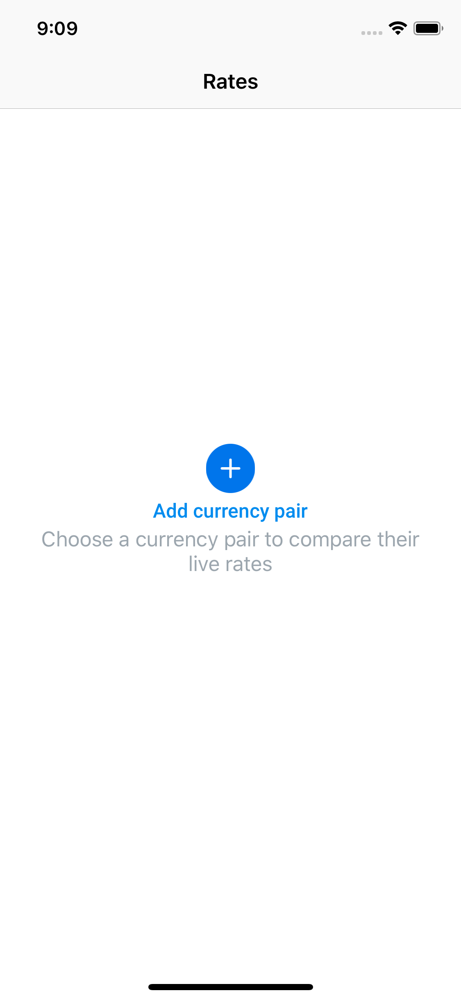
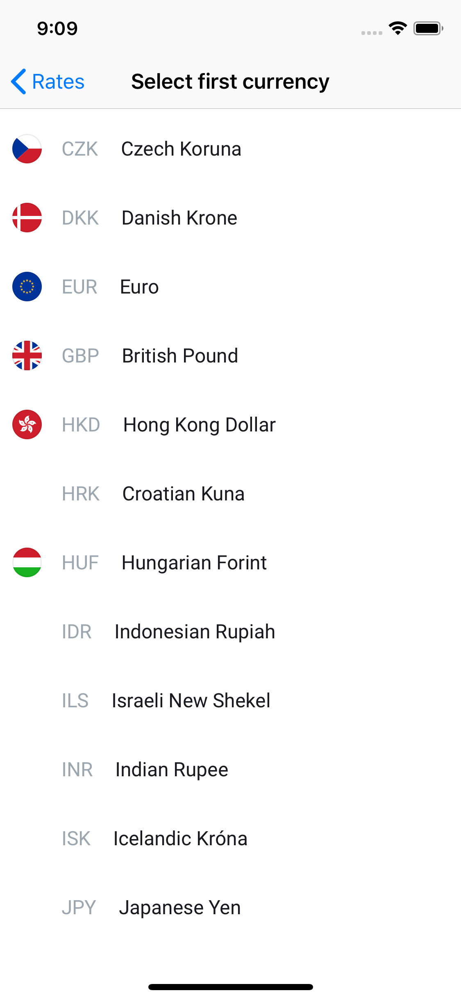
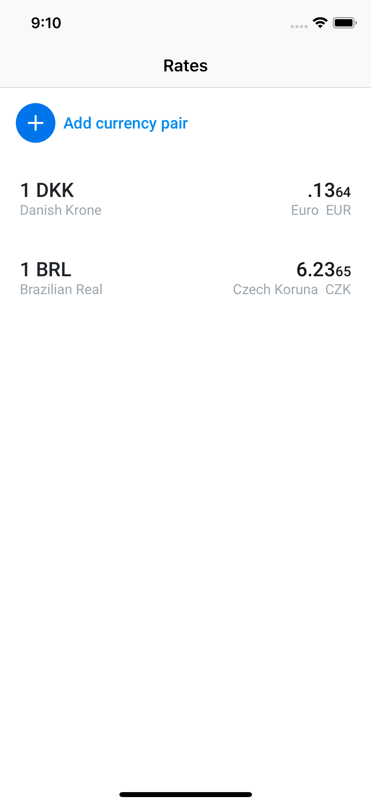

# ExchangeRates Application

Just a simple exchange rates app.
The app request and update currency rates using an API.

Users can:
 - Add a new currency pair 
 - Remove a currency pair

The list of currency pairs preserve across app launches.

## Used technologies
Swift, CoreData, UnitTest, MVVM, SwiftLint

## Screenshots
 |  Empty Rates  |  Add Currency | Rates |
 | ------------- | ------------- | ------------- |
 |  |  |  |
